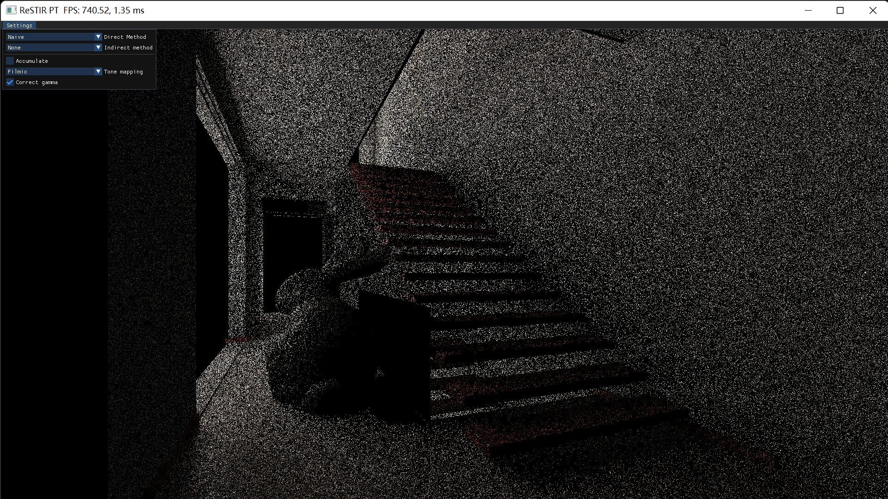
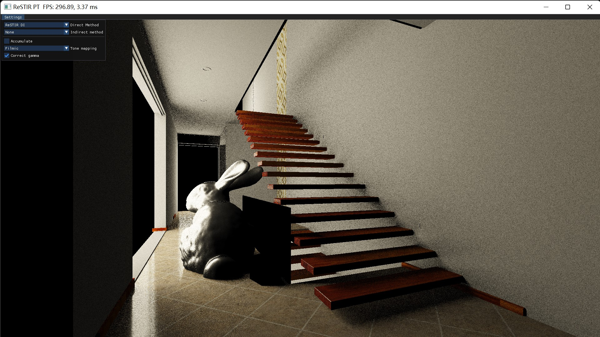
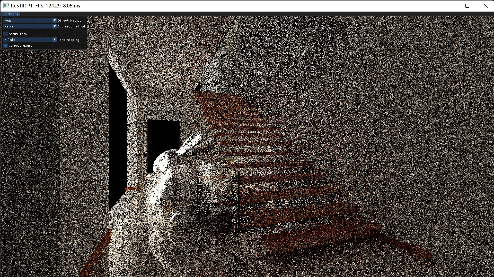
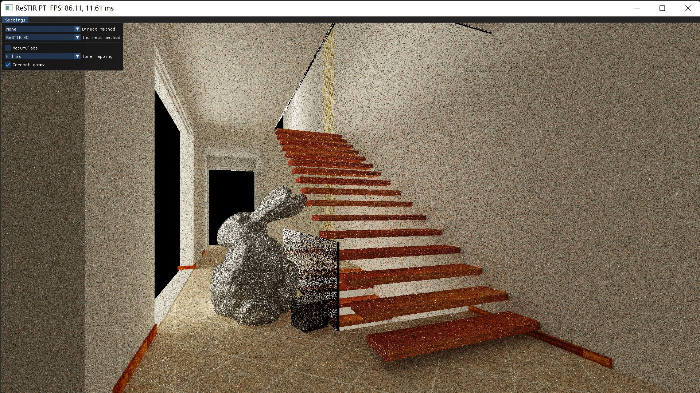

## Vulkan ReSTIR PT

This is another Vulkan ray tracing project, aiming for rebuilding [*EIDOLA*](https://github.com/IwakuraRein/CIS-565-Final-VR-Raytracer) completely from scratch and adding *ReSTIR PT (GRIS)* for indirect illumination.

### Contributor

- Chang Liu

### Progress

- [x] Standard path tracing with NEE and MIS
- [ ] ReSTIR DI
  - [x] Temporal reuse
  - [ ] Spatial reuse
- [ ] ReSTIR GI
  - [x] Temporal reuse
  - [ ] Spatial reuse
- [ ] ReSTIR PT
  - [x] Reconnection vertex generation
  - [ ] Shift mapping
    - [ ] Reconnection
    - [ ] Hybrid
  - [ ] Temporal reuse
  - [ ] Spatial reuse
  - [ ] MIS
- [ ] Support for both ray tracing pipeline & ray query
- [ ] Batched G-buffer draw call
- [ ] Cache & memory improvement as RTXDI
- [ ] Improve scene definition & GLTF loader
- [ ] Async command recording & submission
- [ ] Denoiser?
- [ ] Make separate ZVK Vulkan wrapper
- [ ] Direct3D 12 backend? (Making this project a multi-backend ray tracing engine)

| Naive                   | Resampled                  |      |
| ----------------------- | -------------------------- | ---- |
|  |  | DI   |
|  |  | GI   |

