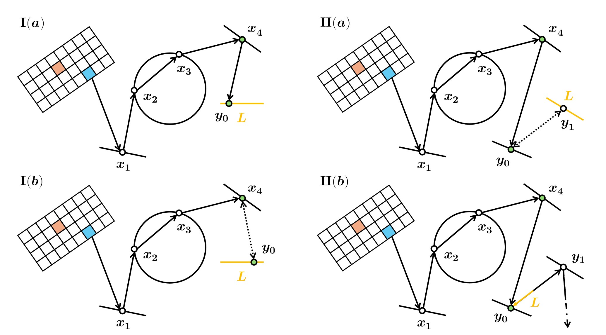

## Vulkan ReSTIR PT

This is another Vulkan ray tracing project, aiming for rebuilding [*EIDOLA*](https://github.com/IwakuraRein/CIS-565-Final-VR-Raytracer) completely from scratch and adding *ReSTIR PT (GRIS)* for indirect illumination.

### Build and Run

- Clone `git clone [this repo] --recursive`
- Run `./build.bat` (for Windows only)
- Extract `.zip` test scene files in `./res/model/`
  - `VeachAjar` from [paper's modified version of 'Veach Ajar' scene](https://github.com/DQLin/ReSTIR_PT/tree/master/Source/RenderPasses/ReSTIRPTPass/Data/VeachAjar)
  - You will need to copy `./res/` to your IDE's working directory for the resources to be correctly loaded

### Progress

- [x] Standard path tracing with NEE and MIS
- [ ] ReSTIR DI
  - [x] Temporal reuse
  - [x] Spatial reuse
- [ ] ReSTIR GI
  - [x] Temporal reuse
  - [ ] Spatial reuse
- [ ] ReSTIR PT
  - [x] Reconnection vertex generation
  - [x] Shift mapping
    - [ ] Reconnection
    - [ ] Random Replay
    - [x] Hybrid
  - [x] Temporal reuse
  - [x] Spatial reuse
  - [ ] MIS
- [x] Support for both ray tracing pipeline & ray query
- [x] Batched G-buffer draw calls and bindless resource fetching
- [ ] Cache & memory improvement as RTXDI
- [ ] Improve scene definition & GLTF loader
- [ ] Async command recording & submission
- [ ] Denoiser?
- [x] Make separate ZVK Vulkan wrapper
- [ ] Direct3D 12 backend? (Making this project a multi-backend ray tracing engine)

### Algorithm

#### Reusing Paths

    
    

#### Path Sample Generation

    
    

### Result

#### ReSTIR PT (Not all correct)

    

    
    
    

#### Compared to Paper

#### More

